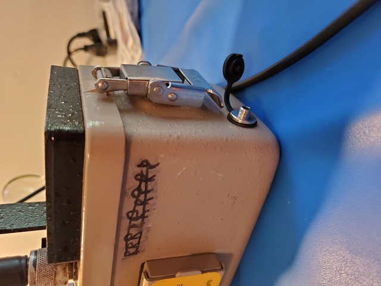

# ludlum-3-esp32-scaler

DIY scaler for the Ludlum 3 survey meter based on an ESP32 board

## Description

This repository contains my schematics and code for a DIY scaler and data logger for the [Ludlum Model 3 survey meter](https://ludlums.com/products/health-physics/product/model-3) **circa 2000**.

**IMPORTANT:** this project is specific to my circa-2000 meter, serial 161535, and the board used at that time. The manual for the Model 3, August 1999, Serial No. 158918 and succeeding, is available on the [Geiger Counter Enthusiasts groups.io file section](https://groups.io/g/GeigerCounters/files/Manuals/LUDLUM/Ludlum%20model%203%20manuals/LUDLUM%20MODEL%203%20Serial%20No.%20158918%20and%20succeeding.pdf). This board has a 4-pin J4 option connector which is generally not populated unless the scaler option was added by the factory (in which case you probably don't need this information). Connector J4 has +5VDC, Ground, Pulse, and Battery + pins. The pulse pin is normally floating, and is pulled to ground for each count/pulse.

## Hardware

## Parts

* 4-pin Header for J4 - TE Connectivity / AMP 640456-4. This matches the factory headers but is polarized and latches. Currently [$0.23 USD from Mouser](https://www.mouser.com/ProductDetail/571-6404564)
* TE / AMP 3-643814-4 4-pin polarized latching closed-end 24 AWG receptacle. Currently [$0.38 USD from Mouser](https://www.mouser.com/ProductDetail/571-3-643814-4)
* strain relief cover for above. Currently [$0.45 USD from Mouser](https://www.mouser.com/ProductDetail/571-6430754)
* TE / AMP 59803-1 MTA-100 maintenance tool, for making the above connections. Currently [$35.10 USD from Mouser](https://www.mouser.com/ProductDetail/571-598031)
* 3.5mm (1/8") TRS phone connector for the pulse output. I chose a Switchcraft 35FM3LS which accepts standard or locking plugs. Currently [$9.05 USD from Mouser](https://www.mouser.com/ProductDetail/502-35FM3LS)
* Switchcraft CAP35L dust cover for above. Currently [$1.99 USD from Mouser](https://www.mouser.com/ProductDetail/502-CAP35L)
* 3.5mm (1/8") TRS phone plug. I chose a locking Switchcraft 35HDLSN12. Currently [$11.30 from Mouser](https://www.mouser.com/ProductDetail/502-CAP35L)
* 4N25 optocoupler. I chose a LiteOn 4N25. Currently [$0.47 USD from Mouser](https://www.mouser.com/ProductDetail/859-4N25)
* ESP32 board. There are many available. I chose some random, relatively well-reviewed ones on Amazon, the [DORHEA ESP-32S](https://www.amazon.com/gp/product/B086MLNH7N/). Currently $20.79 USD for a four pack. You can get the real Espressif ones from Mouser or another electronics shop, but they'll be quite a bit more expensive. I always use the inexpensive no-name microcontroller boards from Amazon and they work fine.
* 56-ohm 1/4W 1% resistor
* Hookup wire (24 AWG), solder, shrink tubing, test leads, etc.

### Assembly

1. Solder the 4-pin connector to the board for J4.
2. Drill a 3/8" hole in the can (bottom shell of the meter) for the TRS phone connector and de-burr it. I'd love to put one on the panel/face instead, but the only safe space I could find was on the can. I opted to put it on the short side closest to the meter, as that's where I want to mount the display (see photos).
3. Solder long leads to the Tip and Ring terminals of the TRS jack. Feed the leads through the hole and install the jack (being sure to install the dust cover, if desired).
4. Solder a 56-ohm 1/4W 1% resistor to ping 1 of a 4N25 optocoupler, and a lead to that. Solder a lead to pin 2 of the 4N25. Add heat shrink around pin 1.
5. Slip a small piece of heat shrink over the lead to the Tip of the TRS jack. Cut both leads to approximately 6 inches.
6. Strip the ends of both leads. Solder the Tip lead to pin 5 of the optocoupler and shrink the heat shrink tubing. Solder the Ring lead to pin 4 of the optocoupler.
7. Slip the entire 4N25 assembly into some large heat shrink tubing with the leads coming out opposite ends, and shrink it.
8. Wire up the panel connector. J4 should be on the lower right corner of the panel; pin 1 is closest to the edge of the panel and pin 4 is closest to the header next to it. Using the TE maintenance tool, terminate the leads from the input side of the 4N25 assembly to the receptacle. The lead from the resistor off of pin 1 on the optocoupler should go to position 1 on the receptacle (J4 pin 1, +5v). The lead from pin 2 of the optocoupler should go to position 3 on the receptacle (J4 pin 3, pulse). When finished, snap strain relief cap over wires.
9. To test thus far: Insert a 3.5mm TRS plug into the jack. Clip test leads to the Tip and Ring pins. Connect the tip lead to GPIO 4 on your ESP32 and the ring lead to Ground on the ESP32. Power it up and write [inputtest.py](inputtest.py) to the board and run it. Turn on the meter and you should see counts.

## Software

### Board preparation

Install [MicroPython](https://docs.micropython.org/en/latest/esp32/quickref.html#installing-micropython) on your ESP32. This repository is currently written for MicroPython 1.13.

### Writing to the board

1. Install the [rshell python package](https://pypi.org/project/rshell/) locally.
2. Plug the board in to your USB port and note the device created for it; this should be ``/dev/ttyUSBn`` where ``n`` is an integer.
3. ``rshell -p /dev/ttyUSBn``
4. Copy the file you want (for ``inputtest.py``, use that) to ``main.py`` on the board: ``cp inputtest.py /pyboard/main.py``
